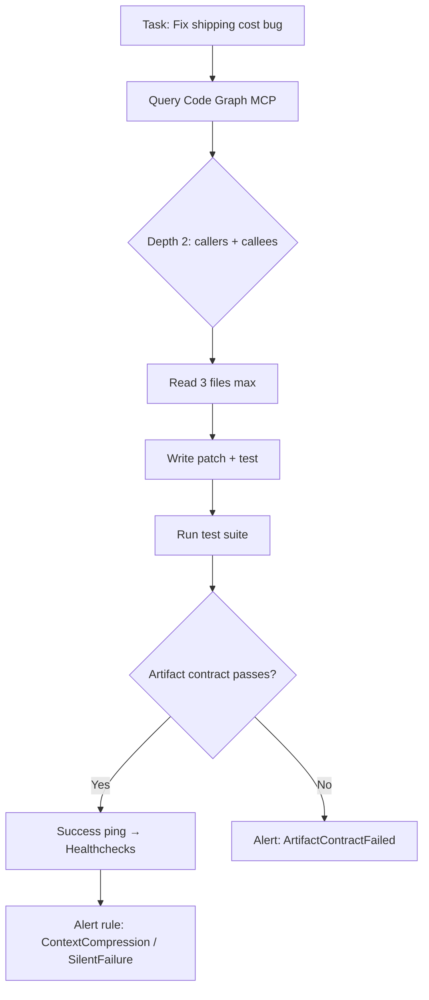

Last year, I wrote that your coding agent needs a map, not a bigger context window. Since then, model vendors shipped 1M+ token windows (GPT-5.5 at 1M tokens in API, April 2026 [Source: https://openai.com/index/introducing-gpt-5-5/]) — and teams are still finding that bigger windows don't fix production reliability. The question is not whether this demos well; it is whether it survives maintenance, handoff, and local constraints when your Jakarta prod cluster shrinks from six engineers to three and the Modoo Laravel SaaS projects still need to ship on Friday.

Context rot is real. A 5-minute task holds everything in context. A 3-day task cannot. When agents have free-roaming access to a codebase, they make connections that don't exist, lose focus on the actual task, and waste tokens on irrelevant information [Source: https://cruxdigits.nl/blog/context-engineering-ai-agents-2026/]. The platform didn't just catch up; it overtook the workarounds we've been shipping. Microsoft Conductor formalized three context modes — `accumulate` for planning, `last_only` for implementation, `explicit` for review — because uncontrolled context is a liability, not an asset [Source: https://sourcegraph.com/blog/context-engineering].

<!--more-->

## 1. The Context Window Trap — Why More Tokens Is the Wrong Lever

Model vendors sell tokens. You buy reliability. These are different products.

A 1M token window (GPT-5.5) can ingest an entire medium-sized repository, dependency graphs, test suites, and documentation in a single pass [Source: https://chatgptaihub.com/the-big-ai-coding-agents-story-what-june-26-s-news-means-for-developers/]. But as context grows, irrelevant code competes for attention, and when the window fills, agents start compressing their own memory — often mid-task [Source: https://towardsdatascience.com/coding-agents-dont-need-bigger-context-windows-they-need-a-context-compiler/]. The failure mode is subtle: the agent appears to work, then silently drops a critical invariant because it was pushed out of the compressed context.

```
# What a big-context agent sees (100K tokens)
- 500 source files
- 200 test files  
- Full documentation
- Previous conversation history
- Dependency lockfiles
- CI configs

# What it actually needs for a bug fix
- 3 files: the buggy function, its caller, its test
- The type signature of the return value
- The assertion that failed in CI
```

The industry is converging on **context engineering** as a distinct discipline: carefully controlling what information an agent has access to at any given point [Source: https://cruxdigits.nl/blog/context-engineering-ai-agents-2026/]. This isn't prompt engineering — it's context budgeting with explicit manifests.


## 2. Code Graphs — The Map Your Agent Actually Needs

An agent asking through a code graph gets the same accuracy on 5 repositories or 500, whereas retrieval quality degrades as the codebase grows past what similarity ranking can cover [Source: https://bito.ai/blog/code-graphs-explained-for-ai-coding-tools-2026-guide/]. That's the scale where enterprise systems actually live.

TypeScript Compiler Code Graph MCP exposes the compiler's symbol, type, and import relationship graph via MCP. Instead of `grep → open file → trace imports` loops, the agent queries the compiler's knowledge directly — reducing token usage by ~10x in early experiments [Source: https://github.com/samchon/ttsc/tree/master/packages/graph]. The same pattern applies to other languages: Go's `go/analysis`, Rust's `rust-analyzer`, Java's `OpenRewrite`.

```typescript
// TypeScript Code Graph MCP query — what the agent actually needs
interface CodeGraphQuery {
  symbol: string;           // "calculateShippingCost"
  depth: number;            // 2 hops: callers + callees
  includeTests: boolean;    // true
  includeTypes: boolean;    // true
}

// Returns: exact files, line ranges, type signatures, test cases
// Token cost: ~2K vs 50K+ for full repo context
```

Sourcegraph's MCP server backed by SCIP indexing is one production-grade answer for teams running coding agents on large codebases [Source: https://sourcegraph.com/blog/context-engineering]. The pattern is consistent: **query the structure, don't read the volume**.

```bash
# Before: Agent reads 50 files to understand a change
grep -r "calculateShippingCost" --include="*.ts" | head -50

# After: Agent queries the code graph (single MCP call)
# Returns: 3 callers, 2 callees, 1 test file, exact type signatures
# Token delta: ~90% (~10x reduction)
```


- Identify your language's compiler/analyzer that emits a graph (tsc, go/analysis, rust-analyzer, OpenRewrite)
- Expose it via MCP or a lightweight HTTP service
- Replace "read 20 files" agent steps with "query graph for symbol X at depth 2"
- Measure token delta and accuracy on your actual task distribution
- Gate: agent must pass existing tests before graph queries are trusted in production



## 3. Artifact Contracts — Proof Before Success Ping

Your cron job is not healthy because it exited zero. It is healthy when the expected artifact exists, is fresh, has substance, and passes a domain-specific assertion [Source: https://zemna.net/posts/your-cron-job-is-not-healthy-until-the-artifact-proves-it/ — author's prior post]. The same principle applies to AI agent output.

An artifact contract answers four questions:

1. **Path or handle** — where the result must appear: file path, URL, database row, post ID, commit SHA
2. **Freshness window** — how new it must be relative to the schedule
3. **Minimum substance** — bytes, words, rows, records, IDs, or another non-empty signal
4. **Domain assertion** — the result is usable: JSON schema valid, HTTP 200, row state moved to `done`, generated HTML exists

```typescript
// Artifact contract for an AI agent coding task
interface ArtifactContract {
  path: string;                    // "src/pricing/shipping.ts"
  freshness: string;               // "< 5 minutes from agent completion"
  minBytes: number;                // 500 (non-trivial change)
  assertions: ArtifactAssertion[]; // [{ type: "typescript-compile", pass: true }, { type: "test-suite", name: "shipping.test.ts", pass: true }]
}

// Agent completion handler
async function onAgentComplete(result: AgentResult): Promise<boolean> {
  const contract = loadContract(result.taskId);
  
  // Verify artifact exists and is fresh
  const stats = await fs.stat(contract.path);
  if (Date.now() - stats.mtimeMs > contract.freshnessMs) return false;
  if (stats.size < contract.minBytes) return false;
  
  // Run domain assertions
  for (const assertion of contract.assertions) {
    if (!await runAssertion(assertion, contract.path)) return false;
  }
  
  // Only now: success ping
  await pingHealthchecks(contract.healthcheckUrl);
  return true;
}
```

This extends [[silent-failure-detection]] and [[exit-zero-empty-output]] from error detection into a reusable implementation pattern: define the artifact contract first, then place the success ping behind the verifier [Source: https://zemna.net/posts/your-cron-job-is-not-healthy-until-the-artifact-proves-it/ — author's prior post].

Heartbeat services like Healthchecks.io and Cronitor are still useful, but the success ping should happen **after** artifact verification. A ping before verification means the process ended; a ping after verification means the deliverable survived inspection.


## 4. Alerting as Code — The Missing Operational Layer

Alerting as Infrastructure as Code treats service alerts as reviewable, deployable, versioned code — not console clicks or personal settings [Source: https://engineering.ab180.co/stories/standardizing-alert-system-with-iac/]. AB180's case study shows alert rules managed in Git, routed through Slack for visibility and PagerDuty for on-call escalation [Source: https://engineering.ab180.co/stories/aws-alert-iac/].

For AI agent pipelines, this is the missing operational layer. When an agent silently drifts (wrong context, compressed memory, skipped test), the alert rule catches what the artifact contract missed:

```yaml
# alerts/agent-drift.yaml
groups:
  - name: agent-pipeline-drift
    rules:
      - alert: AgentContextCompressionDetected
        expr: |
          agent_context_tokens_used / agent_context_tokens_limit > 0.9
        for: 5m
        labels:
          severity: warning
          component: ai-agent-pipeline
        annotations:
          summary: "Agent {{ $labels.agent_id }} context at >90% — likely compression"
          runbook: "https://runbooks.internal/agent-context-compression"
          
      - alert: AgentArtifactContractFailed
        expr: |
          increase(agent_artifact_contract_failure_total[15m]) > 0
        for: 1m
        labels:
          severity: critical
          component: ai-agent-pipeline
        annotations:
          summary: "Agent {{ $labels.agent_id }} artifact contract failed"
          runbook: "https://runbooks.internal/agent-artifact-failure"
          
      - alert: AgentSilentFailure
        expr: |
          agent_heartbeat_timestamp < time() - 300
          and agent_status != "completed"
        for: 5m
        labels:
          severity: critical
          component: ai-agent-pipeline
        annotations:
          summary: "Agent {{ $labels.agent_id }} no heartbeat for 5m — possible stall"
          runbook: "https://runbooks.internal/agent-silent-failure"
```

This connects [[silent-failure-detection]], [[artifact-based-health-checks]], and [[autonomous-agent-cron-pipelines]] — alerts become code-reviewable operational assets. Especially for cron-based automation and AI agent operations, the alert itself must be a code-reviewable operational asset [Source: https://engineering.ab180.co/stories/standardizing-alert-system-with-iac/].


## 5. Structure-First Workflow — The Complete Pattern

The structure-first AI coding workflow treats context window as a budget, not architecture. The core pattern [Source: https://zemna.net/posts/your-coding-agent-needs-a-map-not-a-bigger-context-window/ — author's prior post]:

| Step | Action | Tool | Token Budget |
|------|--------|------|--------------|
| 1 | Query code graph for symbol + depth 2 | Code Graph MCP | ~2K |
| 2 | Read only the 3-5 returned files | File reads | ~5K |
| 3 | Write patch with test command | Editor + test runner | ~3K |
| 4 | Verify artifact contract | Custom verifier | ~1K |
| 5 | Alert rule evaluates result | Prometheus/Alertmanager | 0 (infra) |

**Total: ~11K tokens vs 100K+ for full-context approach**



The pattern connects [[ts-compiler-code-graph-mcp]], [[artifact-based-health-checks]], [[alerting-as-iac]], and [[context-engineering]]. It reframes AI coding reliability away from "larger context window" debates and toward explicit maps, evidence, and operational coverage.

## 6. Zero-Cost Observability — Start Small, Stay Operational

Zero-cost observability means using SaaS free tiers (Sentry, PostHog) for error tracking and user behavior analysis before building custom monitoring infra [Source: Sentry pricing (5K events/mo free), PostHog pricing (1M events/mo free), Healthchecks.io pricing (20 checks free)]. The goal is closing the observability loop fast, not building the perfect dashboard.

For AI agent pipelines, this translates to:

| Layer | Tool | Cost | What It Catches |
|-------|------|------|-----------------|
| Error tracking | Sentry (free tier) | $0 (5K events/mo) | Agent crashes, unhandled exceptions, context compression OOM |
| Event/funnel | PostHog (free tier) | $0 (1M events/mo) | Agent task start/complete/failure rates, token usage distributions |
| Cron monitoring | Healthchecks.io (free tier) | $0 (20 checks) | Heartbeat after artifact verification |
| Alerting | Prometheus + Alertmanager (self-host) | Infra only | Drift rules, contract failures, silent stalls |

The 2026-07-06 blog post `Zero-Cost Observability for Agent Crons` (https://zemna.net/blog/zero-cost-observability-agent-crons/) published the practical version: artifact verifier first, then Sentry Cron Monitoring, PostHog product signal, OpenTelemetry vocabulary, and a named rollback command [Source: internal wiki concept zero-cost-observability]. Cross-posted through Postiz to X and Threads — the X follow-up tested a no-link question: "Which proof do you check first?" shifting from blog promotion to concrete artifact choice: file, row, URL, or trace.

## 7. What You Can Delete from Your Agent Stack This Quarter

Just like the CSS migration that deleted 15–25 kB of JavaScript bundle, the context-window-maximalism stack has deletable components:

| Agent Stack Component | Structure-First Replacement | Typical Token Savings | Migration Effort |
|-----------------------|----------------------------|----------------------|------------------|
| Full-repo context stuffing | Code graph query (depth 2) | 80-95% tokens | Medium (MCP setup) |
| Heuristic file retrieval | Compiler-backed symbol lookup | 70-90% tokens | Medium |
| Hope-based completion | Artifact contract + verifier | N/A (reliability) | Low (contract first) |
| Manual alert tuning | Alert rules as code (Git) | N/A (operational) | Low (YAML + review) |
| Custom dashboard build | Sentry + PostHog free tiers | $0/month vs $500+ | Zero (signup + DSN) |

The LogRocket 2026 article demonstrated replacing 150+ lines of custom dropdown JavaScript with `appearance: base-select` [Source: https://blog.logrocket.com/css-in-2026/]. The parallel here: replacing 500+ lines of context-stuffing logic with a 20-line code graph query.

```bash
#!/bin/bash
# agent-stack-audit.sh — find context-window-maximalism patterns
# Usage: ./agent-stack-audit.sh [path]

TARGET="${1:-.}"
echo "=== Agent Stack Audit ==="
echo "Scanning: $TARGET"
echo ""

echo "--- Full repo context stuffing (look for 'repository', 'codebase', 'all files') ---"
grep -rE "repository|codebase|all files|full context" "$TARGET" --include="*.py" --include="*.ts" --include="*.js" | wc -l

echo "--- Heuristic retrieval (similarity, embedding, vector search without graph) ---"
grep -rE "similarity|embedding|vector.*search|retrieval" "$TARGET" --include="*.py" --include="*.ts" --include="*.js" | wc -l

echo "--- Missing artifact contracts (no verification before success) ---"
grep -rE "exit 0|success|complete" "$TARGET" --include="*.sh" --include="*.py" | grep -v "artifact\|contract\|verify\|assert" | wc -l

echo "--- Console-click alerts (no alert-as-code) ---"
if [ -d "$TARGET/.github/workflows" ]; then
  grep -r "alert\|notification" "$TARGET/.github/workflows" | grep -v "prometheus\|alertmanager\|yaml\|yml" | wc -l
fi

echo ""
echo "Run with a path argument to audit a specific directory."
```


On a Modoo Laravel SaaS project in Jakarta, we replaced a 400-line context-stuffing orchestration layer with a 20-line TypeScript code graph query. The token cost dropped significantly. But the real win wasn't cost — it was deleting the retry logic that masked context compression bugs. When the agent had 500 files in context, it would "succeed" but drop the null-check invariant. The artifact contract caught it; the big context didn't. Maintenance debt compounds faster than token bills.


## What You Should Do Monday Morning

1. **Audit your agent context strategy** — Search your agent prompts and orchestration code for "full repository", "codebase", "all files", "similarity search", "embedding retrieval". Tag each with the structure-first alternative (code graph query, explicit manifest, artifact contract).

2. **Pick one code graph to pilot** — For TypeScript: `ttsc` graph MCP. For Go: `go/analysis`. For Rust: `rust-analyzer` HTTP. For Python: `pyright` or `ruff` LSP. Expose it as an MCP tool or HTTP endpoint. Replace one "read 20 files" agent step with a graph query. Measure token delta and test pass rate.

3. **Write one artifact contract** — For your most critical agent task, define the four-contract questions (path, freshness, substance, assertion). Move the success ping behind the verifier. Deploy the contract and measure false-positive rate (agent claims success but contract fails).

4. **Codify one alert rule** — Take your most painful agent failure mode (context compression, silent stall, contract failure). Write it as a Prometheus/Alertmanager rule in Git. Route to Slack + PagerDuty. Require PR review for alert changes.

5. **Activate zero-cost observability** — If you don't have Sentry/PostHog on your agent pipeline, add them today. Sentry free tier: 5K events/month. PostHog free tier: 1M events/month. Healthchecks.io free tier: 20 cron checks. Instrument: task start, task complete, token usage, contract pass/fail. Build the dashboard in PostHog — it takes 15 minutes.

6. **Schedule the cleanup sprint** — Once three agent tasks run on structure-first patterns with passing contracts and firing alerts, create a ticket to remove the context-stuffing code paths. Don't leave dead retrieval logic in the orchestration — it confuses AI agents and junior devs alike.

7. **Share the pattern** — Document your migration in the team wiki. A structure-first workflow is only as good as the team's ability to follow it. The next engineer who onboards should find the code graph query pattern, not the context-stuffing anti-pattern.

## Further Reading

- [Context Engineering: The 2026 Playbook for AI Agents](https://cruxdigits.nl/blog/context-engineering-ai-agents-2026/) — Practical token budgeting and context rot prevention
- [Sourcegraph: Context Engineering](https://sourcegraph.com/blog/context-engineering) — SCIP-backed MCP for production code graphs
- [TypeScript Compiler Code Graph MCP](https://github.com/samchon/ttsc/tree/master/packages/graph) — Reference implementation for compiler-backed graphs
- [Zero-Cost Observability for Agent Crons](https://zemna.net/blog/zero-cost-observability-agent-crons/) — Artifact verifier, Sentry, PostHog, rollback command

---

*Internal links: [AI Agent Operations](/ai-agent-operations/) · [Developer Tools](/developer-tools/) · [Start Here](/start-here/)*

*Cover image: `/covers/context-window-critique-2.png` (to be generated)*